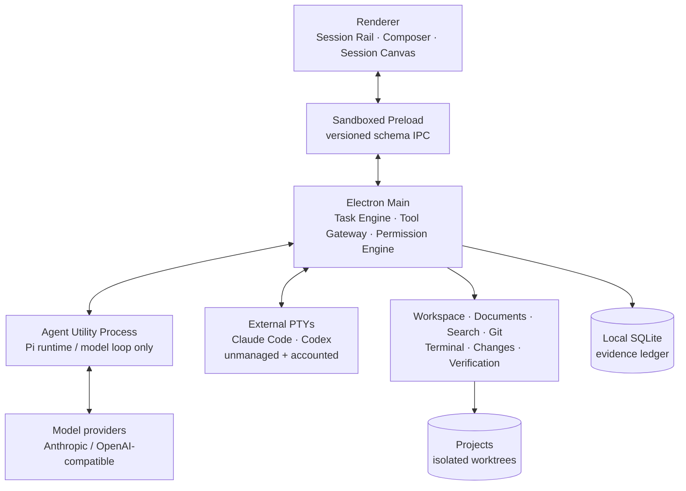

<div align="center">

# Charter

### Observable agent work, from prompt to proof.

Charter is a local-first desktop IDE for delegating real repository work to coding agents without giving up visibility or control.

[](#project-status)
[](https://github.com/longyunfeigu/Charter/actions/workflows/ci.yml)
[](LICENSE)
[](https://charter-15n.pages.dev)
[](package.json)
[](https://www.electronjs.org/)

[English](README.md) · [简体中文](README.zh-CN.md)

[Why Charter](#why-charter) · [Product tour](#product-tour) · [Quick start](#quick-start) · [Architecture](#architecture) · [Contributing](#contributing)

</div>


<p align="center"><sub>One Session keeps the conversation, evidence, code, verification, and decision in view.</sub></p>

> [!IMPORTANT]
> Charter is a **development preview**. The core desktop workflow is implemented and tested, but packaging, signing, update delivery, and stable-release migration guarantees are still in progress. Building from source is the supported way to try it today.

## Why Charter

Most coding-agent tools make the model easy to start. Charter focuses on everything that happens after you press Enter: what the agent did, where it did it, whether the result works, and whether you want to keep it.

In Charter, a **Session** is the complete unit of human-agent work:

```text
Session = project + agent + worktree + conversation + plan
        + files + terminals + preview + verification + review
```

- **One composer, multiple agents.** Start the managed Charter Agent, Claude Code, or Codex without entering a different product shell.
- **Work is isolated by default.** Coding Sessions operate in dedicated Git worktrees so review and rollback remain explicit.
- **Evidence stays beside the conversation.** File writes, commands, diffs, previews, checks, approvals, and decisions form one chronological ledger.
- **Review is a first-class step.** Inspect a selectable, line-numbered diff; run recorded checks; request changes; roll back; or approve.
- **Context is concrete.** Attach files, selected line ranges, search results, terminal output, and preview feedback as structured references instead of vague prose.
- **Local-first and inspectable.** Projects stay on your machine, task state is recorded locally, and provider credentials never enter the renderer.

## Product tour

### One prompt box for every backend

Choose an agent, project, permission mode, model, and verification plan in one composer. Charter Agent runs through the managed tool gateway; installed Claude Code and Codex CLIs keep their native terminal experience inside the same Session model.


### Proof before approval

The review surface is built from recorded evidence rather than a generated summary alone. It keeps the outcome, changed files, verification history, and final actions together.


### The Session canvas

The left rail is the only global navigation. The center keeps the human-agent conversation and live execution ledger. The contextual canvas opens files, diffs, previews, terminals, and review without replacing the Session.

| Session capability | What it provides |
| --- | --- |
| **Conversation & plan** | The goal, plan approval, follow-ups, and agent responses in one timeline |
| **Live evidence** | Current action, file activity, commands, elapsed time, and recorded outputs |
| **File & Diff** | File Peek, structured code context, selectable change ledger, and inline hunks |
| **Preview & Terminal** | Worktree-scoped app preview, visual feedback, and persistent real PTYs |
| **Verification** | Recorded checks with passed, failed, stale, and superseded history |
| **Review & Replay** | Request changes, rollback, approve, and audit the completed Session later |

## Quick start

### Prerequisites

- [Node.js](https://nodejs.org/) **22.19 or newer** (Node 24 is used in CI)
- npm
- Git

### Run from source

```bash
git clone https://github.com/longyunfeigu/Charter.git
cd Charter
npm install
npm run dev
```

On first launch:

1. Open a Git project.
2. Open **Settings → Models**, add a provider, and fetch its model list.
3. Create a Session, choose the agent and permission mode, then describe the outcome you want.

Charter currently includes presets for Anthropic, OpenAI, OpenRouter, and LiteLLM, plus custom Anthropic- or OpenAI-compatible endpoints. Credentials are encrypted with Electron's OS-backed `safeStorage`; the renderer sees only redacted configuration metadata.

> [!NOTE]
> Local-first describes Charter's project orchestration, state, and evidence storage—not offline inference. Prompts and the context you attach are sent to the model endpoint you configure and remain subject to that provider's data policy.

To explore the complete flow without a provider key on macOS or Linux, use the deterministic mock runtime:

```bash
PI_IDE_FORCE_MOCK=1 npm run dev
```

To use **Claude Code** or **Codex** as external agents, install their CLI separately and make sure its executable is available on `PATH`.

## Architecture

Charter keeps the renderer, model loop, tool execution, and project data in separate trust boundaries.



The managed Agent Utility Process owns the model loop, but it cannot directly read files, run commands, or access secrets. Tool requests return to Electron Main, where the Tool Gateway applies schemas, workspace boundaries, permission policy, execution, redaction, and evidence recording.

External Claude Code and Codex sessions have a deliberately different trust boundary: Charter preserves their PTY, detects their lifecycle, accounts for repository changes, and brings the result into review, but their internal permissions remain the responsibility of the external CLI.

### Permission model

| Level | Typical operation | Default treatment |
| --- | --- | --- |
| **R0 — Read** | Read files, search, diagnostics, `git status` / `diff` | Allowed |
| **R1 — Workspace write** | Create or edit files inside the isolated worktree | Ask, or allow after plan/mode policy |
| **R2 — Local execution** | Known local commands and verification | Known checks may run; unknown commands ask |
| **R3 — External / irreversible** | Networked or consequential operations | Explicit confirmation every time |
| **R4 — Blocked** | `sudo`, `git push`, secret reads, writes outside the workspace, broad destructive commands | Rejected by the product |

Application-level permissions are not an operating-system sandbox. Review commands before approval and use isolated environments for untrusted repositories or instructions.

## Repository layout

```text
apps/
  desktop-main/       Electron host, IPC routing, task engine, services
  desktop-preload/    Narrow, versioned renderer bridge
  desktop-renderer/   Session-first React interface
  agent-worker/       Isolated managed model loop
packages/
  agent-runtime-pi/   Pi runtime adapter
  tool-gateway/       Tool policy, execution, and evidence boundary
  persistence/        Local SQLite state and ledger
  *-service/          Workspace, Git, files, search, terminal, verification
tests/
  unit + security + performance + Playwright Electron E2E
docs/
  product specification, ADRs, implementation status, and release evidence
```

The most useful design and engineering references are:

- [Implementation status](docs/IMPLEMENTATION_STATUS.md) — what is implemented, verified, or still in progress
- [Product and engineering specification](docs/PRODUCT_ENGINEERING_SPEC.md) — requirements, state machines, security, and acceptance criteria
- [Session-first UX pivot](docs/UX_PIVOT_SPEC.md) — the product-object and shell model
- [Architecture decisions](docs/DECISIONS.md) — ADR index and rationale
- [Release checklist](docs/RELEASE_CHECKLIST.md) — what still blocks a stable release

## Development

| Command | Purpose |
| --- | --- |
| `npm run dev` | Build and launch the Electron app in development mode |
| `npm run build` | Produce renderer, preload, main, and worker builds |
| `npm run check` | Run formatting, architecture-boundary, and TypeScript checks |
| `npm test` | Run the unit and integration suite |
| `npm run test:e2e` | Build and run the Playwright Electron suite |
| `npm run test:security` | Run secret scanning, security tests, build, and security E2E |
| `npm run test:perf` | Run performance gates |
| `npm run package -- --dir-only` | Build an unpacked desktop artifact for smoke testing |

For a focused Electron test while iterating:

```bash
npm run build
npx playwright test \
  --config tests/e2e/playwright.config.ts \
  tests/e2e/session-canvas.spec.ts
```

README screenshots are reproducible from the real application:

```bash
npm run build
CHARTER_README_SHOTS=1 npx playwright test \
  --config tests/e2e/playwright.config.ts \
  tests/e2e/readme-assets.spec.ts
```

## Project status

Charter is being developed in public toward its first stable desktop release.

- The Session-first shell, managed agent path, external CLI accounting, isolated changes, code context, preview, terminal, verification, review, replay, and core security boundaries are implemented.
- Stable installers, signing/notarization, update channels, migration guarantees, and final release qualification are not complete.
- The intended stable targets are macOS and Windows; Linux is a preview target.

See [IMPLEMENTATION_STATUS.md](docs/IMPLEMENTATION_STATUS.md) for the evidence-backed status of each milestone and [RELEASE_CHECKLIST.md](docs/RELEASE_CHECKLIST.md) for the remaining release gates.

## Contributing

Contributions that strengthen the Session model, evidence quality, platform reliability, security boundaries, accessibility, or release readiness are especially welcome.

1. Read [AGENTS.md](AGENTS.md) and the relevant product or ADR documentation.
2. Pick a scoped item from the [implementation backlog](docs/IMPLEMENTATION_BACKLOG.md) or open an issue describing the behavior you want to change.
3. Keep architectural boundaries intact and add tests proportional to the risk.
4. Run `npm run check`, `npm test`, and `npm run build` before opening a pull request; include targeted Electron E2E evidence for UI changes.

Please do not mark speculative or partially implemented behavior as complete. Charter's contribution standard is simple: claims should be backed by observable evidence.

## License

Charter is available under the [MIT License](LICENSE).
