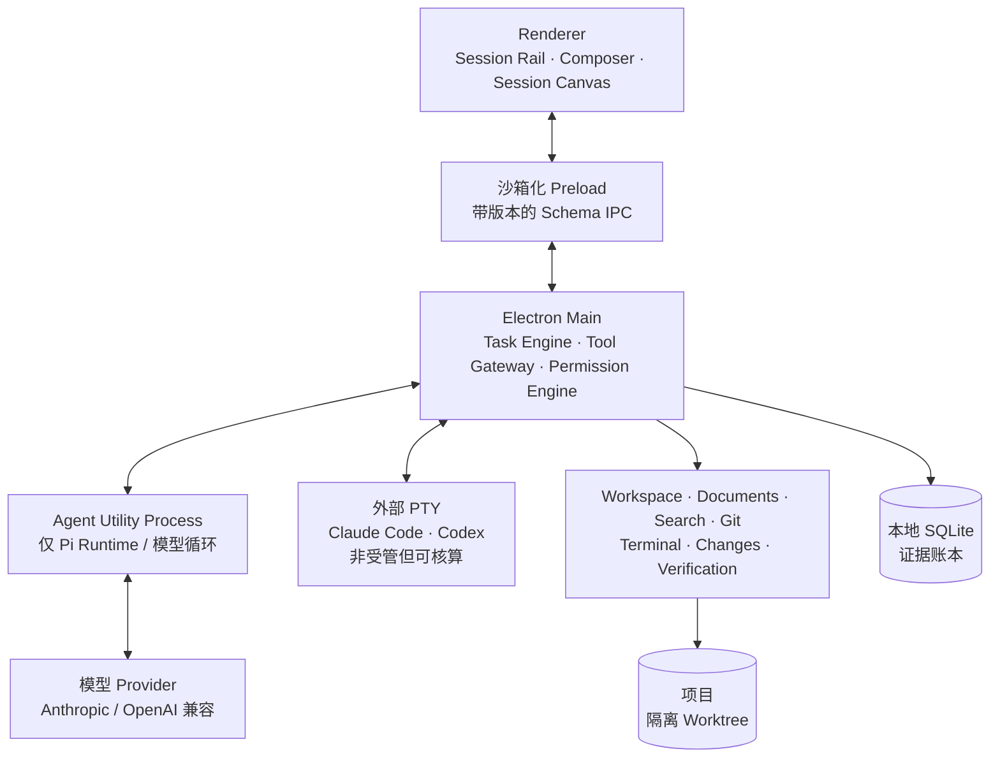

<div align="center">

# Charter

### 从提示词到证明，让 Agent 工作全程可见。

Charter 是一款本地优先的桌面 Agent IDE：你可以把真实仓库任务交给编码 Agent，同时保留对过程、权限、验证与最终结果的控制。

[](#项目状态)
[](https://github.com/longyunfeigu/Charter/actions/workflows/ci.yml)
[](LICENSE)
[](https://charter-15n.pages.dev)
[](package.json)
[](https://www.electronjs.org/)

[English](README.md) · [简体中文](README.zh-CN.md)

[为什么是 Charter](#为什么是-charter) · [产品一览](#产品一览) · [快速开始](#快速开始) · [架构](#架构) · [参与贡献](#参与贡献)

</div>


<p align="center"><sub>一个 Session，让对话、证据、代码、验证和最终决策始终处于同一个上下文。</sub></p>

> [!IMPORTANT]
> Charter 当前是**开发预览版**。无需付费证书的 Beta 安装包会以 unsigned GitHub prerelease 发布，并附校验和与 SBOM；操作系统安全策略可能阻止运行。若本机不允许 unsigned 应用，请从源码构建。签名 Stable 仍未完成。

## 为什么是 Charter

大多数编码 Agent 产品解决了“如何启动模型”，Charter 更关注你按下回车之后发生的一切：Agent 做了什么、在哪里做、结果是否真的有效，以及你是否愿意保留这些改动。

在 Charter 中，**Session** 是一次完整人机协作的基本对象：

```text
Session = 项目 + Agent + Worktree + 对话 + 计划
        + 文件 + 终端 + 预览 + 验证 + 审查
```

- **一个 Composer 对所有 Agent。** 在同一个入口启动受管 Charter Agent、Claude Code 或 Codex，不进入另一套产品壳。
- **默认隔离工作。** 编码 Session 使用独立 Git worktree，让审查、合并和回滚都保持明确。
- **证据就在对话旁边。** 文件写入、命令、Diff、预览、检查、审批与决策组成同一条时间账本。
- **审查不是收尾弹窗。** 可以查看可选择、带行号的 Diff，运行并记录检查，请求修改、回滚或批准。
- **上下文是结构化对象。** 文件、选中代码、搜索结果、终端输出和预览反馈都能作为真实引用交给 Agent，而不是模糊地粘贴一段文字。
- **本地优先、边界清晰。** 项目留在本机，任务状态保存在本地，Provider 凭据永远不会进入 Renderer。

## 产品一览

### 一个 Prompt Box，连接所有执行后端

在一个 Composer 中选择 Agent、项目、权限模式、模型和验证计划。Charter Agent 通过受管 Tool Gateway 执行；已安装的 Claude Code 与 Codex CLI 则保留原生终端体验，同时归入相同的 Session 对象。


### 先看证明，再决定是否批准

Review 界面来自真实记录的证据，而不只是一段由模型生成的总结。结果、改动文件、验证历史和最终操作都放在同一个区域。


### Session Canvas

左侧 Rail 是唯一全局导航，中间保持人机对话和实时执行账本，右侧上下文工具区打开 File、Diff、Preview、Terminal 与 Review，但不会替换当前 Session。

| Session 能力 | 提供什么 |
| --- | --- |
| **对话与计划** | 目标、计划审批、追问和 Agent 回复处于同一条时间线 |
| **实时证据** | 当前动作、文件活动、命令、耗时与记录输出 |
| **File 与 Diff** | File Peek、结构化代码上下文、可选择的改动列表与内联 Hunk |
| **Preview 与 Terminal** | Worktree 级应用预览、视觉反馈与持久真实 PTY |
| **Verification** | 保留通过、失败、过期和被替代状态的检查记录 |
| **Review 与 Replay** | 请求修改、回滚、批准，以及事后审计完整 Session |

## 快速开始

### 下载 unsigned Beta

从 [GitHub Releases](https://github.com/longyunfeigu/Charter/releases) 下载当前平台安装包和
`SHA256SUMS.txt`。macOS/Windows 产物未签名、未公证，启动前请阅读
[已知限制](docs/KNOWN_LIMITATIONS.md)。预览版采用手工更新。

### 环境要求

- [Node.js](https://nodejs.org/) **22.19 或更高版本**（CI 使用 Node 24）
- npm
- Git

### 从源码运行

```bash
git clone https://github.com/longyunfeigu/Charter.git
cd Charter
npm install
npm run dev
```

首次启动后：

1. 打开一个 Git 项目。
2. 进入 **Settings → Models**，添加 Provider 并拉取模型列表。
3. 创建 Session，选择 Agent 与权限模式，然后描述你真正想要的结果。

Charter 当前提供 Anthropic、OpenAI、OpenRouter 与 LiteLLM 预设，也支持自定义 Anthropic/OpenAI 兼容端点。凭据通过 Electron 基于操作系统的 `safeStorage` 加密；Renderer 只能看到脱敏后的配置元数据。

> [!NOTE]
> “本地优先”描述的是 Charter 的项目编排、状态与证据存储，并不代表离线推理。Prompt 及你附加的上下文会发送到所配置的模型端点，并遵循对应 Provider 的数据政策。

如果暂时没有 Provider Key，可以在 macOS 或 Linux 上使用确定性 Mock Runtime 体验完整流程：

```bash
PI_IDE_FORCE_MOCK=1 npm run dev
```

如果要使用外部 **Claude Code** 或 **Codex**，请先独立安装对应 CLI，并确保可执行文件已经加入 `PATH`。

## 架构

Charter 将 Renderer、模型循环、工具执行和项目数据放在不同的信任边界内。



受管 Agent Utility Process 只负责模型循环，不能直接读取文件、运行命令或访问密钥。所有 Tool 请求都会返回 Electron Main，由 Tool Gateway 统一执行 Schema 校验、Workspace 边界检查、权限判断、命令执行、脱敏与证据记录。

外部 Claude Code 与 Codex 有意保留不同的信任边界：Charter 会保留其 PTY、检测生命周期、核算仓库改动并将结果带入 Review，但 CLI 内部的权限仍由外部工具自身负责。

### 权限模型

| 等级 | 典型操作 | 默认处理 |
| --- | --- | --- |
| **R0 — 只读** | 读文件、搜索、诊断、`git status` / `diff` | 允许 |
| **R1 — Workspace 写入** | 在隔离 Worktree 内创建或修改文件 | 询问，或按计划/模式策略允许 |
| **R2 — 本地执行** | 已识别的本地命令与验证 | 已知检查可运行；未知命令询问 |
| **R3 — 外部 / 不可逆** | 联网或具有明显后果的操作 | 每次都需显式确认 |
| **R4 — 禁止** | `sudo`、`git push`、读取密钥、Workspace 外写入、大范围破坏性命令 | 产品层直接拒绝 |

应用层权限不等同于操作系统沙箱。批准前应审查命令；处理不可信仓库或指令时，请使用额外的隔离环境。

## 仓库结构

```text
apps/
  desktop-main/       Electron 宿主、IPC、Task Engine 与服务
  desktop-preload/    窄接口、带版本的 Renderer Bridge
  desktop-renderer/   Session-first React 界面
  agent-worker/       隔离的受管模型循环
packages/
  agent-runtime-pi/   Pi Runtime 适配层
  tool-gateway/       工具策略、执行和证据边界
  persistence/        本地 SQLite 状态与账本
  *-service/          Workspace、Git、文件、搜索、终端与验证
tests/
  单元、安全、性能与 Playwright Electron E2E
docs/
  产品规格、ADR、实施状态与发布证据
```

建议先阅读：

- [实施状态](docs/IMPLEMENTATION_STATUS.md) — 哪些能力已实现、已验证或仍在进行
- [产品与工程规格](docs/PRODUCT_ENGINEERING_SPEC.md) — 需求、状态机、安全边界与验收标准
- [Session-first UX 重构规格](docs/UX_PIVOT_SPEC.md) — 产品对象与统一壳层模型
- [架构决策](docs/DECISIONS.md) — ADR 索引与设计理由
- [发布检查表](docs/RELEASE_CHECKLIST.md) — 距离 Stable 仍有哪些阻断项

## 开发

| 命令 | 用途 |
| --- | --- |
| `npm run dev` | 构建并以开发模式启动 Electron 应用 |
| `npm run build` | 构建 Renderer、Preload、Main 与 Worker |
| `npm run check` | 运行格式、架构边界与 TypeScript 检查 |
| `npm test` | 运行单元与集成测试 |
| `npm run test:e2e` | 构建并运行 Playwright Electron 测试 |
| `npm run test:security` | 运行密钥扫描、安全测试、构建与安全 E2E |
| `npm run test:perf` | 运行性能门禁 |
| `npm run package -- --dir-only` | 构建用于 Smoke Test 的未打包桌面产物 |

迭代 UI 时可运行目标 Electron 测试：

```bash
npm run build
npx playwright test \
  --config tests/e2e/playwright.config.ts \
  tests/e2e/session-canvas.spec.ts
```

README 截图可以从真实应用中重复生成：

```bash
npm run build
CHARTER_README_SHOTS=1 npx playwright test \
  --config tests/e2e/playwright.config.ts \
  tests/e2e/readme-assets.spec.ts
```

## 项目状态

Charter 正在公开开发，并朝首个桌面 Stable 版本推进。

- Session-first 壳层、受管 Agent、外部 CLI 核算、隔离改动、代码上下文、Preview、Terminal、Verification、Review、Replay 与核心安全边界已经实现。
- unsigned Beta 的 macOS/Windows/Linux 打包、发布清单、校验和、SBOM/许可证、打包态启动和数据库升级/失败恢复演练已经完成。
- 签名/公证、自动更新、真实模型固定任务评估和最终 Stable 发布仍是开放门槛。
- 计划中的 Stable 平台为 macOS 与 Windows；Linux 定位为 Preview。

完整进度与证据请查看 [IMPLEMENTATION_STATUS.md](docs/IMPLEMENTATION_STATUS.md)，剩余发布门禁请查看 [RELEASE_CHECKLIST.md](docs/RELEASE_CHECKLIST.md)。

## 参与贡献

我们尤其欢迎能够强化 Session 对象、证据质量、平台可靠性、安全边界、无障碍体验或发布就绪度的贡献。

1. 先阅读 [AGENTS.md](AGENTS.md) 以及相关产品规格或 ADR。
2. 从[实施 Backlog](docs/IMPLEMENTATION_BACKLOG.md) 中选择范围清晰的任务，或先创建 Issue 描述希望改变的行为。
3. 保持架构边界，并根据风险补充相应层级的测试。
4. 提交 Pull Request 前运行 `npm run check`、`npm test` 与 `npm run build`；UI 修改需要附带目标 Electron E2E 证据。

请不要把推测性或部分完成的能力标为完成。Charter 的贡献标准很简单：每一项主张都应有可观察的证据支持。

## 许可证

Charter 基于 [MIT License](LICENSE) 开源。
